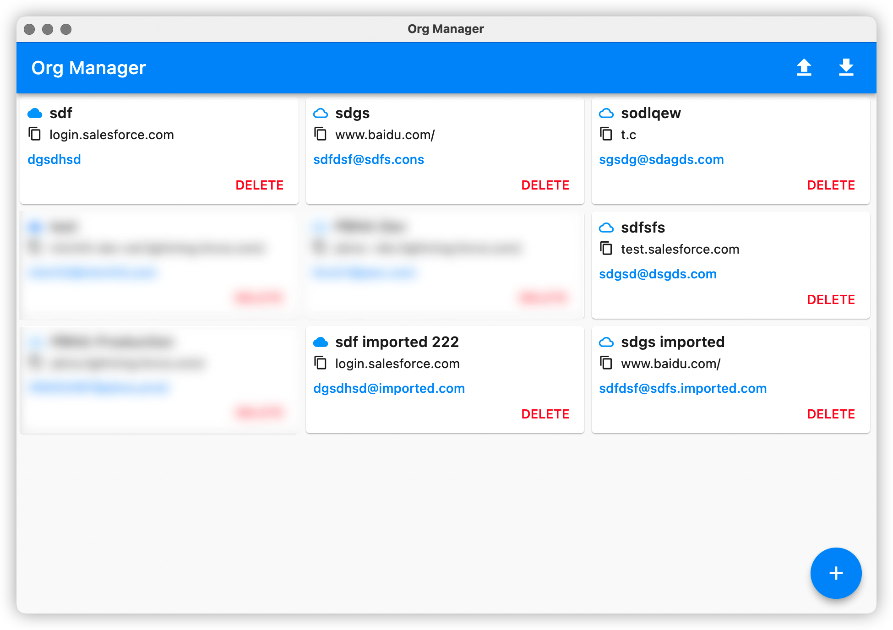
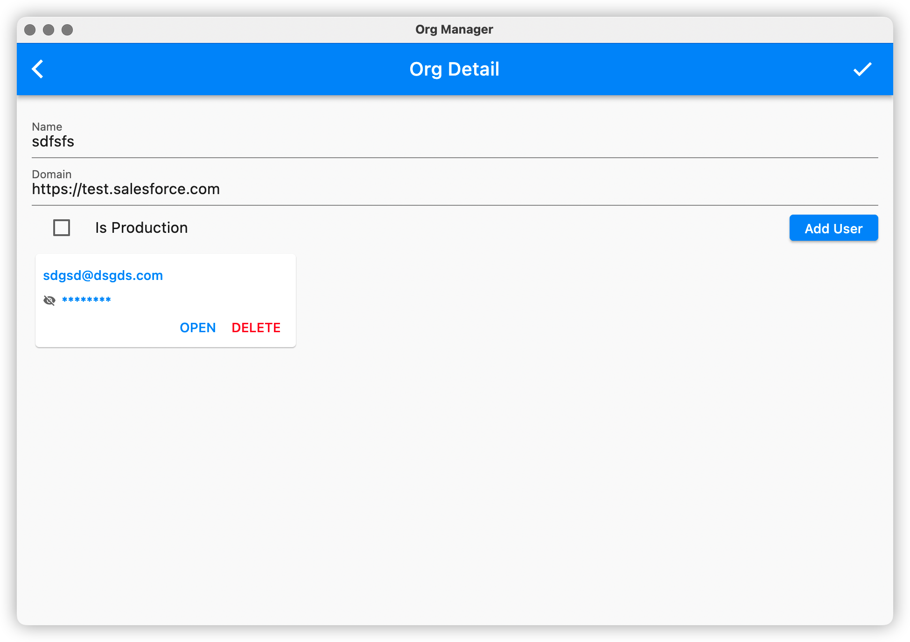
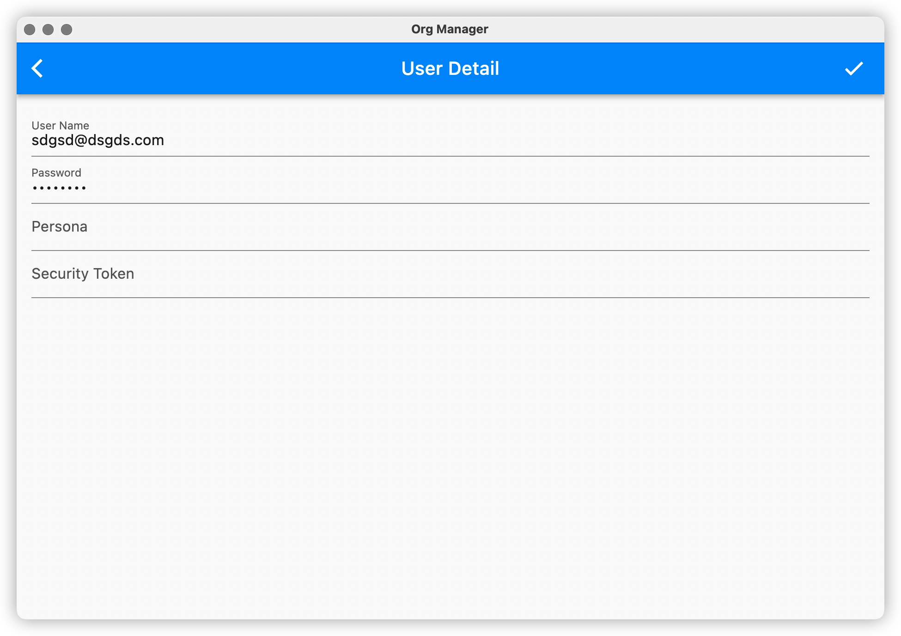

# Guide

## Main Screen

1. You can click the `+` button at right bottom of the screen to add a new org.
2. You can click the import/export button at top right corner to import/export your org. The file format is in JSON. A sample JSON file can be found here: [import_sample.json](../example/import_sample.json). 
3. You can click the "Copy" icon before your org domain at second line of each org tile to copy your org domain. 
4. You can click the username at third line of each org tile quickly open your browser and login to your org. Because of the limitation of the Salesforce after 22 release, you need to manually copy your password to the login form. Don't worry, by the time you click the username, the app automatically copy the password to your system clipboard for you. All you need to do is to press "Ctrl/Command + V" to paste your password to the login form and press "login" button.
5. You can click the "Delete" button at the right bottom of each org tile to delete your org.

## Org Detail Screen

1. Name and domain is required, I strongly recommend you to replace "https://<test/login>.salesforce.com" with your org domain or the org launcher function may not work.
2. You can click the username or password of each user tile to copy it.
3. You can open your org by clicking the 'OPEN' button at right bottom of each tile.

## User Detail Screen

1. Username and password are required. Username must be your real username in your org.
2. You can also record your security token here so that you can easily use Salesforce OAuth 2.0.

